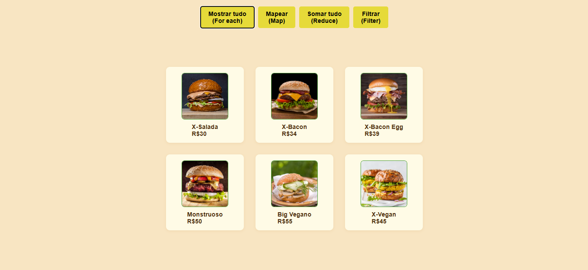
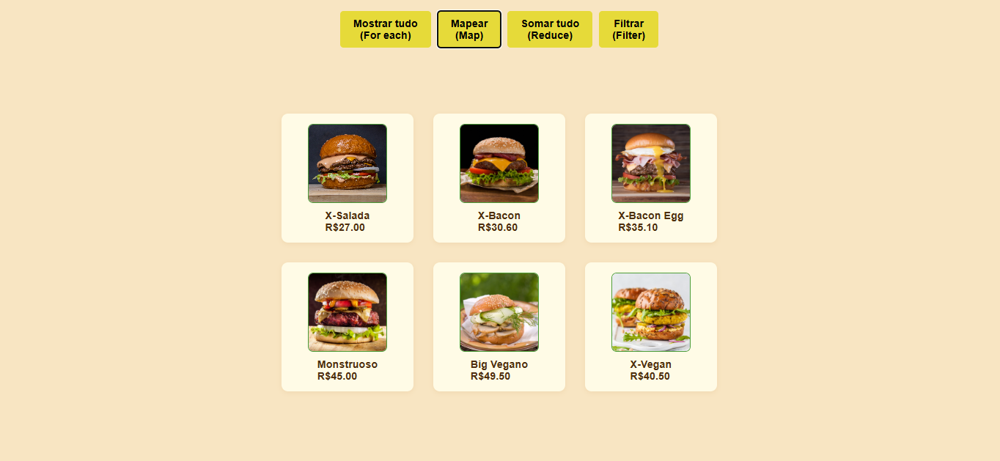
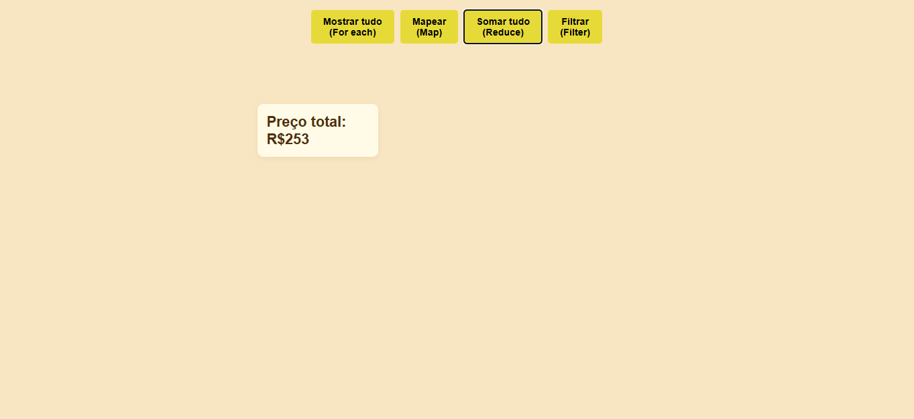
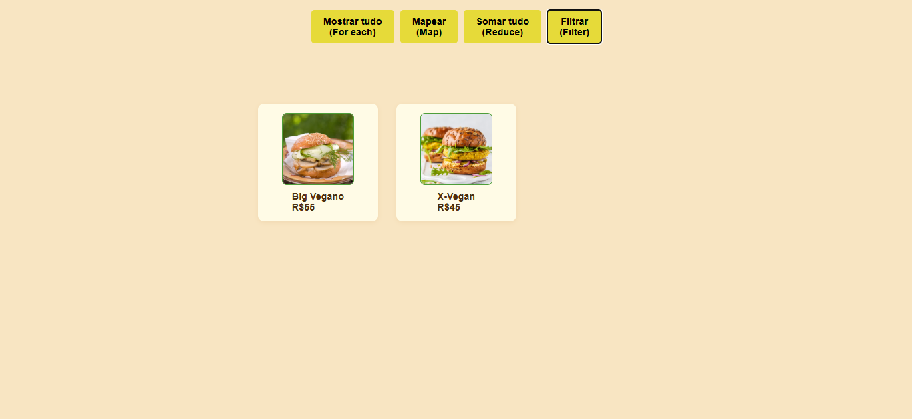

# MapReduceFilter Hamburgueria

Projeto de demonstração dos métodos de array do JavaScript (`forEach`, `map`, `reduce`, `filter`) aplicado a uma lista de hambúrgueres.

## Funcionalidades

- **Mostrar tudo (ForEach):** Exibe todos os hambúrgueres disponíveis.
- **Mapear (Map):** Exibe todos os hambúrgueres com preço 10% menor.
- **Somar tudo (Reduce):** Mostra o preço total de todos os hambúrgueres.
- **Filtrar (Filter):** Exibe apenas os hambúrgueres veganos.

## Como usar

1. Clone o repositório.
2. Abra a pasta no VS Code.
3. Execute o arquivo `index.html` em seu navegador.

## Prints das funções

### Mostrar tudo

### Mapear preços

### Somar tudo

### Filtrar veganos

## Tecnologias

- HTML
- CSS
- JavaScript

---

Projeto acadêmico para fins de aprendizado.
